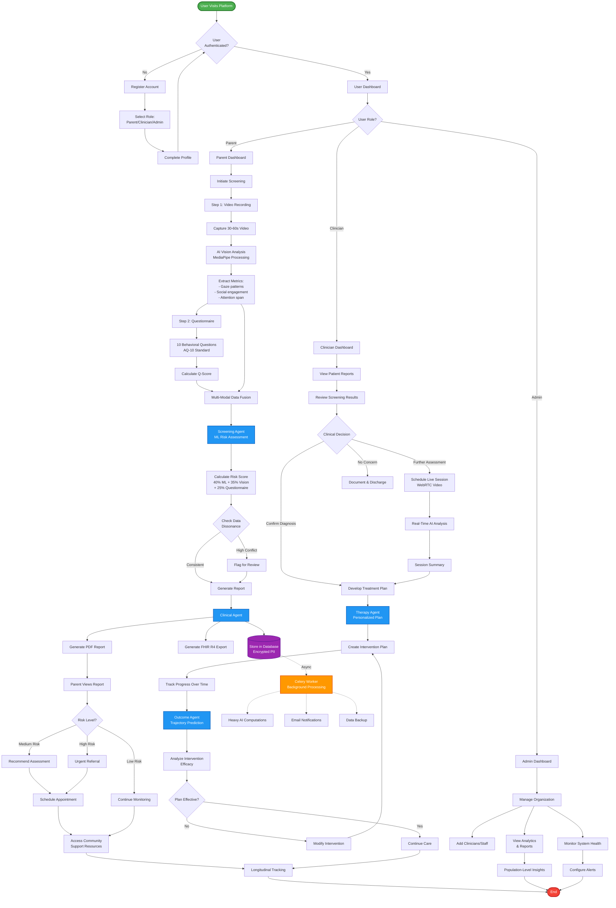
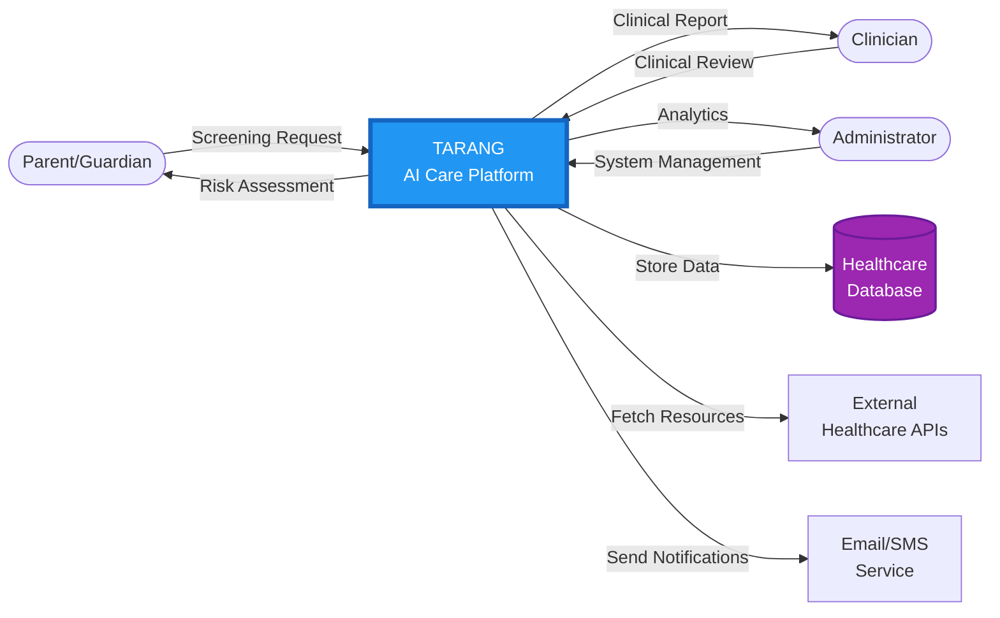
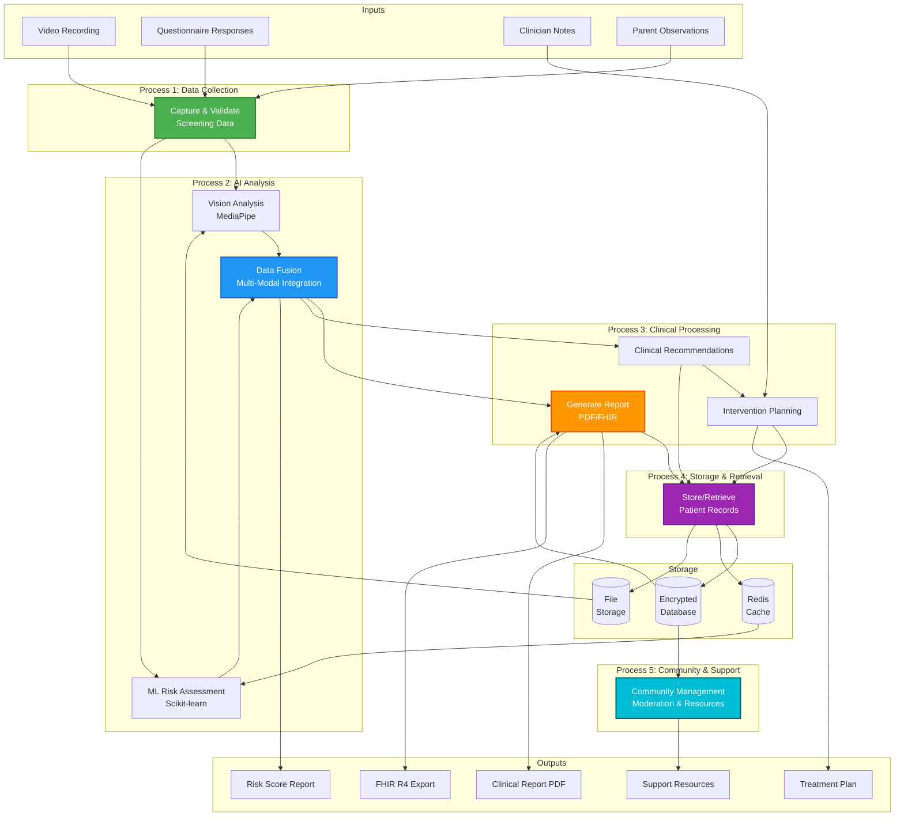
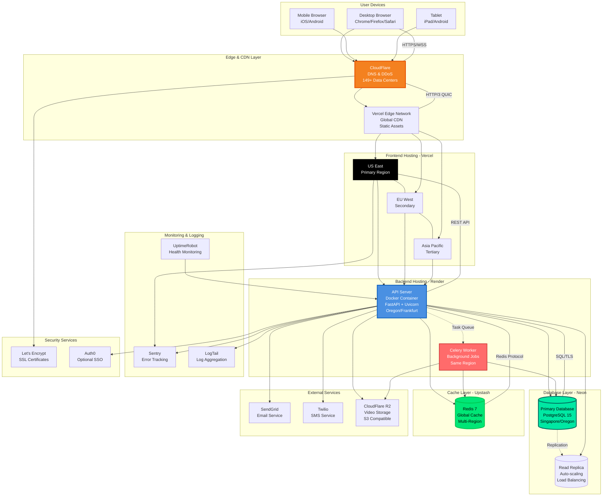
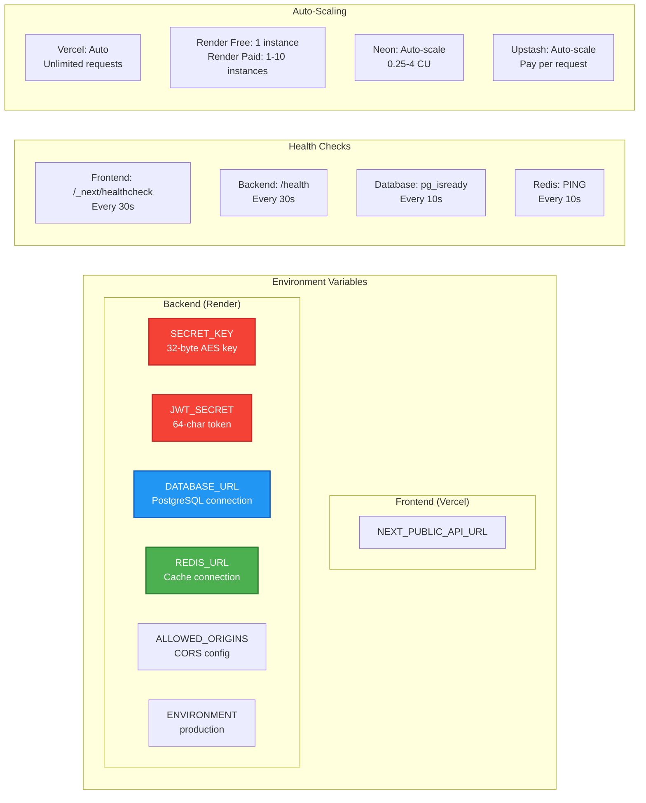
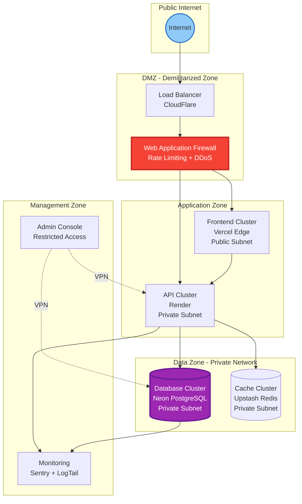

# 📊 TARANG Platform Diagrams

## Table of Contents
1. [Process Flow Diagram](#process-flow-diagram)
2. [Use Case Diagram](#use-case-diagram)
3. [Architecture Diagram](#architecture-diagram)
4. [Data Flow Diagram](#data-flow-diagram)
5. [Deployment Diagram](#deployment-diagram)

---

## Process Flow Diagram

### Complete Screening & Care Process Flow

---

## Use Case Diagram

### TARANG Platform Use Cases

```mermaid
graph TB
    subgraph Actors
        Parent([Parent/Guardian])
        Clinician([Clinician/Doctor])
        Admin([System Admin])
        System([AI System])
    end
    
    subgraph "Authentication & Authorization"
        UC1[Register Account]
        UC2[Login/Logout]
        UC3[Manage Profile]
        UC4[Reset Password]
    end
    
    subgraph "Screening & Assessment"
        UC5[Initiate Screening]
        UC6[Record Video]
        UC7[Complete Questionnaire]
        UC8[View Risk Score]
        UC9[Download Report]
        UC10[Export FHIR Data]
        UC11[Schedule Live Session]
        UC12[Conduct Video Assessment]
    end
    
    subgraph "Clinical Management"
        UC13[Review Patient Reports]
        UC14[Create Treatment Plan]
        UC15[Track Progress]
        UC16[Schedule Appointments]
        UC17[Generate Clinical Notes]
        UC18[Prescribe Interventions]
    end
    
    subgraph "Community & Support"
        UC19[Browse Community Posts]
        UC20[Create Post]
        UC21[Get AI Help]
        UC22[Access Resources]
        UC23[Connect with Parents]
    end
    
    subgraph "Administration"
        UC24[Manage Organizations]
        UC25[Add/Remove Users]
        UC26[View Analytics]
        UC27[Configure System]
        UC28[Monitor Health]
        UC29[Manage Centers]
    end
    
    subgraph "AI Processing"
        UC30[Analyze Video]
        UC31[Calculate Risk Score]
        UC32[Generate Report]
        UC33[Predict Trajectory]
        UC34[Moderate Content]
        UC35[Match Resources]
    end
    
    %% Parent Use Cases
    Parent --> UC1
    Parent --> UC2
    Parent --> UC3
    Parent --> UC4
    Parent --> UC5
    Parent --> UC6
    Parent --> UC7
    Parent --> UC8
    Parent --> UC9
    Parent --> UC10
    Parent --> UC16
    Parent --> UC19
    Parent --> UC20
    Parent --> UC21
    Parent --> UC22
    Parent --> UC23
    
    %% Clinician Use Cases
    Clinician --> UC2
    Clinician --> UC3
    Clinician --> UC11
    Clinician --> UC12
    Clinician --> UC13
    Clinician --> UC14
    Clinician --> UC15
    Clinician --> UC16
    Clinician --> UC17
    Clinician --> UC18
    Clinician --> UC19
    Clinician --> UC26
    
    %% Admin Use Cases
    Admin --> UC2
    Admin --> UC3
    Admin --> UC24
    Admin --> UC25
    Admin --> UC26
    Admin --> UC27
    Admin --> UC28
    Admin --> UC29
    
    %% System Use Cases
    System --> UC30
    System --> UC31
    System --> UC32
    System --> UC33
    System --> UC34
    System --> UC35
    
    %% Include Relationships
    UC5 -.->|includes| UC6
    UC5 -.->|includes| UC7
    UC6 -.->|includes| UC30
    UC7 -.->|includes| UC31
    UC8 -.->|includes| UC32
    UC20 -.->|includes| UC34
    UC21 -.->|includes| UC35
    UC15 -.->|includes| UC33
    
    %% Extend Relationships
    UC9 -.->|extends| UC8
    UC10 -.->|extends| UC8
    UC12 -.->|extends| UC13
    
    style Parent fill:#4CAF50,stroke:#2E7D32,stroke-width:3px,color:#fff
    style Clinician fill:#2196F3,stroke:#1565C0,stroke-width:3px,color:#fff
    style Admin fill:#F44336,stroke:#C62828,stroke-width:3px,color:#fff
    style System fill:#FF9800,stroke:#E65100,stroke-width:3px,color:#fff
```

---

## Architecture Diagram

### System Architecture - Multi-Layer Design

```mermaid
graph TB
    subgraph "Client Layer"
        Browser[Web Browser<br/>Desktop/Mobile]
        PWA[Progressive Web App]
    end
    
    subgraph "CDN & Edge"
        Vercel[Vercel Edge Network<br/>Global CDN]
        CloudFlare[CloudFlare<br/>DDoS Protection]
    end
    
    subgraph "Frontend Layer - Next.js 15"
        NextApp[Next.js Application]
        
        subgraph "Pages & Routes"
            Landing[Landing Page]
            Auth[Auth Pages<br/>Login/Register]
            Dashboard[Dashboards<br/>Parent/Clinician/Admin]
            Screening[Screening Interface]
            Reports[Report Viewer]
            Community[Community Portal]
            Clinical[Clinical Tools]
        end
        
        subgraph "Frontend Components"
            UI[UI Components<br/>Tailwind CSS]
            MediaPipe[MediaPipe Vision<br/>Client-side AI]
            WebRTC[WebRTC Client<br/>Video Streaming]
            Charts[Recharts<br/>Data Visualization]
        end
        
        subgraph "State Management"
            Zustand[Zustand Store]
            AuthContext[Auth Context<br/>JWT Management]
            ReactQuery[React Query<br/>Cache]
        end
    end
    
    subgraph "API Gateway Layer"
        APIGateway[FastAPI Gateway<br/>Port 8000]
        RateLimit[Rate Limiter<br/>SlowAPI]
        CORS[CORS Middleware]
        JWTAuth[JWT Authentication]
        InputValidation[Pydantic Validation]
    end
    
    subgraph "Application Layer - FastAPI"
        subgraph "API Endpoints"
            AuthAPI[Authentication API<br/>/auth/token]
            ScreeningAPI[Screening API<br/>/screening/process]
            ReportsAPI[Reports API<br/>/reports/*]
            CommunityAPI[Community API<br/>/community/*]
            ClinicalAPI[Clinical API<br/>/clinical/*]
            AnalyticsAPI[Analytics API<br/>/analytics/*]
            WSAPI[WebSocket API<br/>/ws/screening]
        end
        
        subgraph "Business Logic"
            SecurityModule[Security Module<br/>Password Hashing<br/>Token Generation]
            ValidationModule[Validation Module<br/>Input Sanitization]
            AuthorizationModule[Authorization<br/>RBAC Logic]
        end
    end
    
    subgraph "AI Agent Layer"
        ScreeningAgent[Screening Agent<br/>ML Risk Assessment<br/>Random Forest]
        ClinicalAgent[Clinical Agent<br/>Report Generation<br/>FHIR R4 Export]
        OutcomeAgent[Outcome Agent<br/>Trajectory Prediction<br/>Intervention Analysis]
        SocialAgent[Social Agent<br/>Content Moderation<br/>Resource Matching]
        TherapyAgent[Therapy Agent<br/>Personalized Plans]
        ClinicianAgent[Clinician Agent<br/>Tele-Health Support]
        SREAgent[SRE Agent<br/>System Monitoring]
    end
    
    subgraph "Data Processing Layer"
        subgraph "Async Workers"
            Celery[Celery Distributed Task Queue]
            Worker1[Worker 1<br/>Video Processing]
            Worker2[Worker 2<br/>ML Inference]
            Worker3[Worker 3<br/>Report Generation]
        end
        
        subgraph "Processing Services"
            VideoProc[Video Processing<br/>Frame Extraction]
            MLInference[ML Inference<br/>Scikit-learn]
            PDFGen[PDF Generation<br/>ReportLab]
            FHIRMap[FHIR Mapper<br/>HL7 R4]
        end
    end
    
    subgraph "Data Layer"
        subgraph "Primary Database"
            Postgres[(PostgreSQL 15<br/>Neon Cloud)]
            
            subgraph "Tables"
                Users[Users<br/>Encrypted PII]
                Patients[Patients<br/>AES-256 Encrypted]
                Sessions[Screening Sessions]
                Reports[Reports]
                Community[Community Posts]
                Progress[Therapy Progress]
                Orgs[Organizations]
            end
        end
        
        subgraph "Cache & Queue"
            Redis[(Redis 7<br/>Upstash)]
            TaskQueue[Task Queue]
            SessionCache[Session Cache]
            APICache[API Response Cache]
        end
        
        subgraph "File Storage"
            S3[Object Storage<br/>S3/CloudFlare R2<br/>Video Files]
            LocalFS[Local Filesystem<br/>Temp Processing]
        end
    end
    
    subgraph "External Services"
        EmailService[Email Service<br/>SendGrid/SES]
        SMSService[SMS Service<br/>Twilio]
        MonitoringService[Monitoring<br/>Sentry/DataDog]
        LogService[Logging<br/>CloudWatch/LogTail]
    end
    
    subgraph "Security Layer"
        SSL[SSL/TLS Encryption<br/>Let's Encrypt]
        Firewall[Web Application Firewall]
        DDoS[DDoS Protection]
        Encryption[AES-256 Encryption<br/>PII Data]
        Audit[Audit Logging]
    end
    
    %% Connections - Client to Frontend
    Browser --> CloudFlare
    PWA --> CloudFlare
    CloudFlare --> Vercel
    Vercel --> NextApp
    
    %% Frontend Internal
    NextApp --> Landing
    NextApp --> Auth
    NextApp --> Dashboard
    NextApp --> Screening
    NextApp --> Reports
    NextApp --> Community
    NextApp --> Clinical
    
    Landing --> UI
    Screening --> MediaPipe
    Screening --> WebRTC
    Reports --> Charts
    
    Dashboard --> Zustand
    Auth --> AuthContext
    
    %% Frontend to Backend
    NextApp --> APIGateway
    WebRTC --> WSAPI
    
    %% API Gateway
    APIGateway --> RateLimit
    RateLimit --> CORS
    CORS --> JWTAuth
    JWTAuth --> InputValidation
    
    %% API Gateway to Endpoints
    InputValidation --> AuthAPI
    InputValidation --> ScreeningAPI
    InputValidation --> ReportsAPI
    InputValidation --> CommunityAPI
    InputValidation --> ClinicalAPI
    InputValidation --> AnalyticsAPI
    InputValidation --> WSAPI
    
    %% Business Logic
    AuthAPI --> SecurityModule
    ScreeningAPI --> ValidationModule
    ReportsAPI --> AuthorizationModule
    
    %% API to Agents
    ScreeningAPI --> ScreeningAgent
    ReportsAPI --> ClinicalAgent
    ClinicalAPI --> OutcomeAgent
    CommunityAPI --> SocialAgent
    ClinicalAPI --> TherapyAgent
    ClinicalAPI --> ClinicianAgent
    AnalyticsAPI --> SREAgent
    
    %% Agents to Workers
    ScreeningAgent -.->|Async| Celery
    ClinicalAgent -.->|Async| Celery
    
    Celery --> Worker1
    Celery --> Worker2
    Celery --> Worker3
    
    Worker1 --> VideoProc
    Worker2 --> MLInference
    Worker3 --> PDFGen
    ClinicalAgent --> FHIRMap
    
    %% Workers to Data
    ScreeningAgent --> Postgres
    ClinicalAgent --> Postgres
    OutcomeAgent --> Postgres
    SocialAgent --> Postgres
    
    Postgres --> Users
    Postgres --> Patients
    Postgres --> Sessions
    Postgres --> Reports
    Postgres --> Community
    Postgres --> Progress
    Postgres --> Orgs
    
    %% Cache Layer
    AuthAPI --> Redis
    ScreeningAPI --> Redis
    Celery --> TaskQueue
    TaskQueue --> Redis
    SessionCache --> Redis
    APICache --> Redis
    
    %% File Storage
    VideoProc --> S3
    Worker1 --> LocalFS
    
    %% External Services
    ClinicalAgent --> EmailService
    TherapyAgent --> SMSService
    APIGateway --> MonitoringService
    APIGateway --> LogService
    
    %% Security
    APIGateway --> SSL
    CloudFlare --> Firewall
    CloudFlare --> DDoS
    Postgres --> Encryption
    APIGateway --> Audit
    
    %% Styling
    style Browser fill:#4CAF50,stroke:#2E7D32,stroke-width:2px,color:#fff
    style APIGateway fill:#2196F3,stroke:#1565C0,stroke-width:3px,color:#fff
    style Postgres fill:#9C27B0,stroke:#6A1B9A,stroke-width:3px,color:#fff
    style Redis fill:#F44336,stroke:#C62828,stroke-width:3px,color:#fff
    style Celery fill:#FF9800,stroke:#E65100,stroke-width:3px,color:#fff
    
    style ScreeningAgent fill:#00BCD4,stroke:#006064,stroke-width:2px,color:#fff
    style ClinicalAgent fill:#00BCD4,stroke:#006064,stroke-width:2px,color:#fff
    style OutcomeAgent fill:#00BCD4,stroke:#006064,stroke-width:2px,color:#fff
    style SocialAgent fill:#00BCD4,stroke:#006064,stroke-width:2px,color:#fff
    style TherapyAgent fill:#00BCD4,stroke:#006064,stroke-width:2px,color:#fff
```

---

## Data Flow Diagram

### Level 0 - Context Diagram

### Level 1 - System Processes

---

## Deployment Diagram

### Production Deployment Architecture

### Deployment Configuration

---

## Network Topology

---

## How to View These Diagrams

### Option 1: GitHub (Automatic Rendering)
- Push this file to GitHub
- GitHub automatically renders Mermaid diagrams

### Option 2: Mermaid Live Editor
1. Go to https://mermaid.live
2. Copy any diagram code
3. Paste into the editor
4. Export as PNG/SVG

### Option 3: VS Code
1. Install "Markdown Preview Mermaid Support" extension
2. Open this file
3. Press `Ctrl+Shift+V` (Windows) or `Cmd+Shift+V` (Mac)

### Option 4: Documentation Sites
- Works in: GitBook, Docusaurus, MkDocs, etc.
- Most modern documentation platforms support Mermaid

---

**Created for TARANG AI Care Platform**  
**Last Updated:** 2026-02-11  
**Diagram Format:** Mermaid.js
